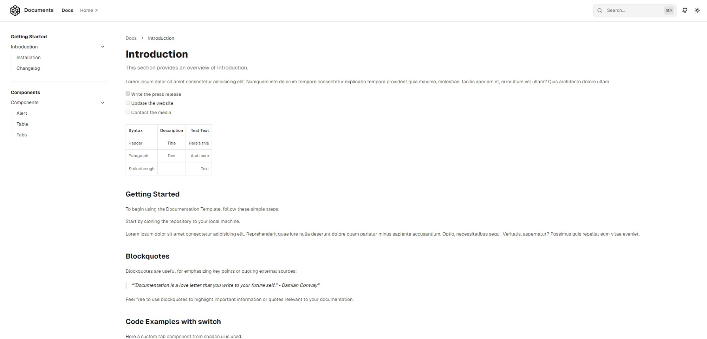
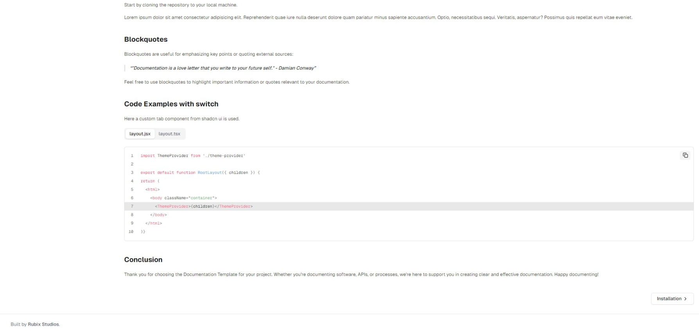
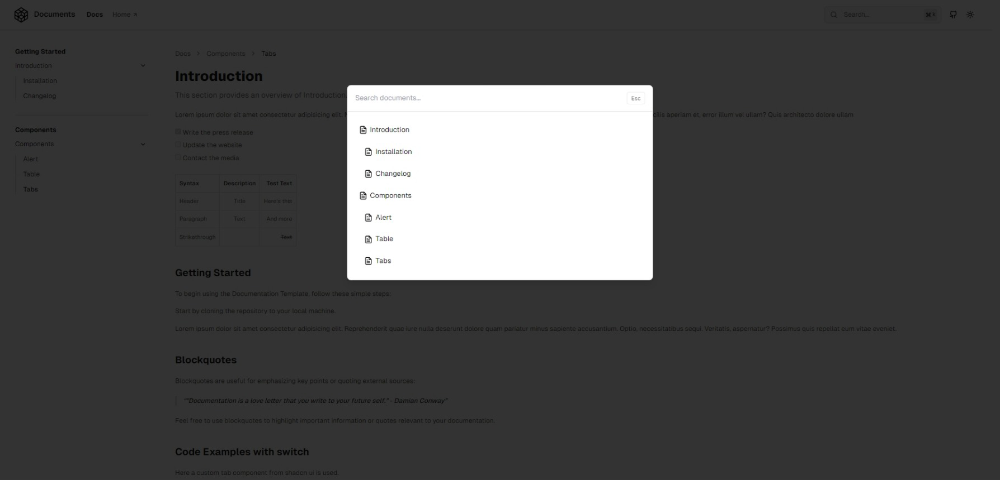
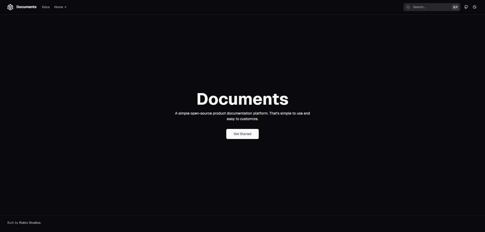
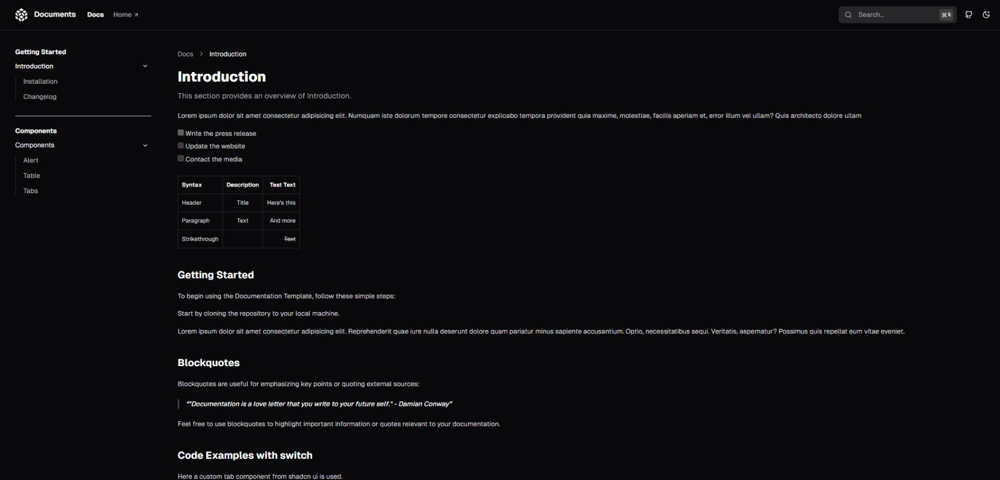

# Documents

**Documents** is a powerful **Next.js** documentation starter kit designed to simplify the process of creating high-quality, comprehensive product documentation, technical manuals and business guides. Built with **React**, **Tailwind CSS** and **TypeScript**, this starter kit provides the foundation to build your project documentation and knowledge base.

**Demo**: [https://rubix-documents.vercel.app/](https://rubix-documents.vercel.app/)

[](https://vercel.com/new/clone?repository-url=https%3A%2F%2Fgithub.com%2Frubixvi%2Frubix-documents&project-name=my-documents&repository-name=my-documents&demo-title=Documents&demo-description=This%20Document%20Starter%20Kit%20is%20developed%20with%20Next.js%2C%20Tailwind%20CSS%20and%20TypeScript.%20It%20serves%20as%20a%20flexible%20and%20scalable%20foundation%20for%20building%20documentation%20websites%20or%20content-driven%20projects.&demo-url=https%3A%2F%2Frubix-documents.vercel.app%2F&demo-image=https%3A%2F%2Fgithub.com%2Frubixvi%2Frubix-documents%2Fblob%2Fmain%2Fpublic%2Fscreens%2Fscreen-1.png)

## Table of Contents

- [Installation](#installation)
- [Usage](#usage)
- [Features](#features)
- [Contributing](#contributing)
- [License](#license)
- [Contact](#contact)

## Documentation

[https://docs.rubixstudios.com.au](https://docs.rubixstudios.com.au) **(In-Development)**

## Development

### Installation

1. Clone the repository:

    ```bash
    git clone https://github.com/rubixvi/rubix-documents.git
    cd rubix-documents
    ```

2. Install dependencies:

    ```bash
    npm install
    ```

3. Run the development server:

    ```bash
    npm run dev
    ```

4. Open [http://localhost:3000](http://localhost:3000) in your browser to see the project.

5. **For Production:**

   - Build the app:

     ```bash
     npm run build
     ```

   - Start the production server:

     ```bash
     npm run start
     ```

   - Open [http://localhost:3000](http://localhost:3000) to view the production build.

   - **If deploying to Vercel,** the build step is automatically handled during deployment.

## Usage

This kit can be used to create product documentation, business websites and guides.


*Main Screen*


*Document Screen*


*Document Footer*


*Document Search*


*Main Dark Mode Screen*


*Document Dark Mode Screen*

## Features

### Content Creation

- **MDX Integration**: Write docs with Markdown & JSX components.
- **Custom Components**: Reuse React components in your docs.
- **Mermaid.js Diagrams**: Create flowcharts & diagrams.
- **Math & Tables**: Include tables & LaTeX math formulas.

### Navigation & Readability

- **Multi-level Navigation**: Nested pages for hierarchy.
- **Content Pagination**: Smooth transitions between pages.
- **Dynamic TOC**: Auto-generated table of contents.
- **Code Switcher**: Toggle & copy code snippets easily.

### Code Features

- **Syntax Highlighting**: Theme-aware highlighting.
- **Enhanced Code Blocks**: Line highlighting & code titles.

### Theming & UX

- **Light/Dark Modes**: Automatic theme switching.
- **SEO Optimization**: Auto-generated metadata for better ranking.
  - Manage meta tags (title, description, URLs, social sharing).

### Search & Future Enhancements

- **Advanced Search**: Fuzzy search with term highlighting.
- **AI Knowledgebase**: Future AI-powered doc tools.

> **Note:** AI documentation support is in development.

## Contributing

1. Fork the repository.
2. Create a new branch (`git checkout -b feature-branch`).
3. Make your changes.
4. Commit your changes (`git commit -m 'Add some feature'`).
5. Push to the branch (`git push origin feature-branch`).
6. Open a pull request.

## License

This project is licensed under the MIT License. See the [LICENSE](./LICENSE) file for details.

## Contact

For support or inquiries, contact Vincent Vu [@rubixvi](https://x.com/rubixvi) on X.

Rubix Studios - [https://www.rubixstudios.com.au](https://www.rubixstudios.com.au)

Project: [https://github.com/rubixvi/rubix-documents](https://github.com/rubixvi/rubix-documents)
